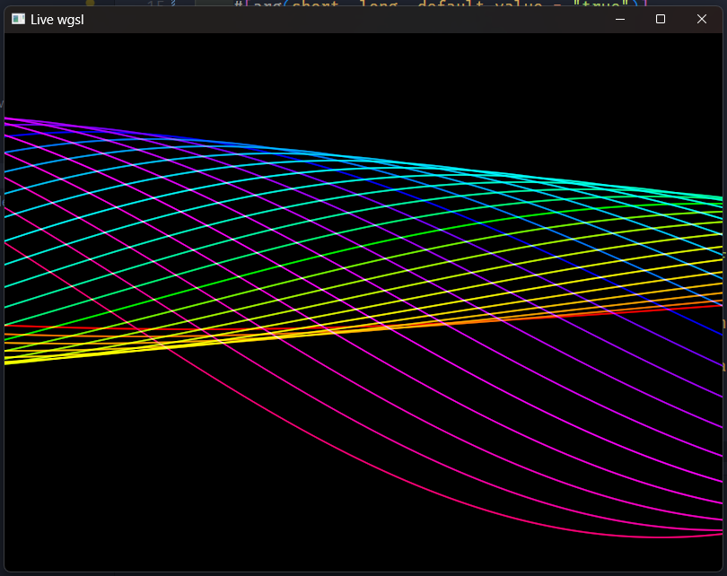

# live-wgsl

A wgsl live coding environment.

## Usage

0. Download executable matching your OS. I recommend rename the executable to shorter name, like `live-wgsl`, for easier usage.

1. Just run from command line.

Command line arguments:

- `-p` / `--path` - path to the wgsl file. Default is `live.wgsl`.
  If file does not exist, it will be created with default shader.
- `-i` / `--interval` - interval in milliseconds to check for shader changes. Default is `200`.

## First time to run in Windows

Windows may make a popup saying that the program is not safe to run.
This is because I do not have a code signing certificate, and the program is not recognized by Windows.
You need to click "More info" and "Run anyway" to let the program run.


## Example

run on windows:

```bash
$ live-wgsl

Edit shader file with your favorite editor!
Shader file: \\?\C:\path\to\live.wgsl

Polling interval: 200 ms

-------------------------------

(updated: 22:57:56) Render time:  233μs
```



## Operation confirmed

- Windows 11 (Vulkan/DX12 backend)
- Linux (Ubuntu 24.04 Vulkan backend)

(tested with Intel and AMD GPUs)

(MacOS is not tested, because I do not have a MacOS machine. If you have one, please try it and let me know if it works. I think it should work.)
